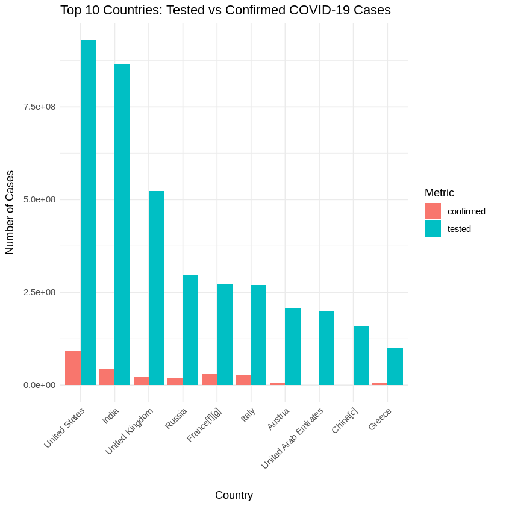
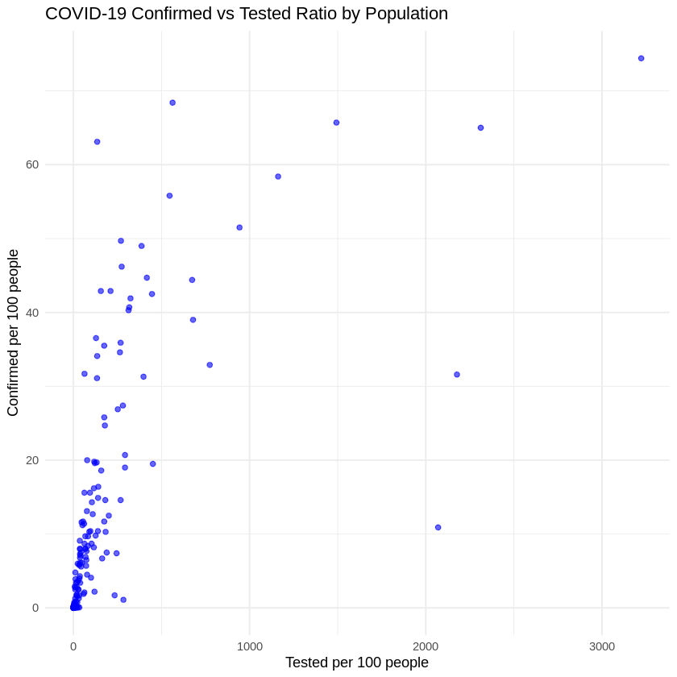
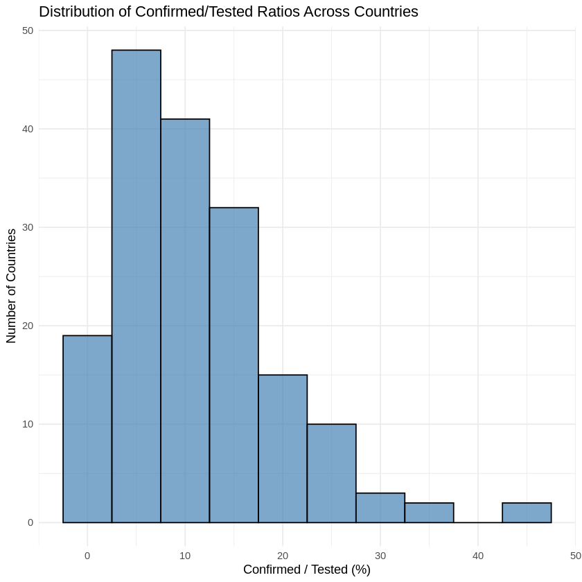

# 🌐 COVID-19 Testing Data Web Scraping with R

[](https://opensource.org/licenses/MIT)  
[](https://cran.r-project.org/)  
[](https://www.r-project.org/)

---
## ▶️ Run the Project in Google Colab

You can run this project directly in your browser without installing anything:  

[](https://colab.research.google.com/drive/1EiVVzT1aP3byMNzeBsrVWF4W0-F65oI_#scrollTo=MKqpwKKPP51H)

---
## 📖 Project Overview

This project demonstrates how to scrape and analyze COVID-19 testing data by extracting it from a Wikipedia template page using R. The workflow involves sending HTTP requests to retrieve the webpage, parsing the HTML content to extract the relevant data table, cleaning and preprocessing the data, and performing simple exploratory analyses. The final dataset is saved as a CSV file for further use.

The goal is to showcase practical skills in web scraping using R packages (httr, rvest), data manipulation (tidyverse), and basic data analysis. 

**Why this project?**  
In the era of big data, being able to automatically extract, process, and visualize information from the web is an essential skill for data scientists and analysts.

---

## 🛠 Technologies Used

- **[R](https://www.r-project.org/)** – Main programming language  
- **[rvest](https://cran.r-project.org/web/packages/rvest/index.html)** – For web scraping  
- **[dplyr](https://dplyr.tidyverse.org/)** – For data manipulation  
- **[ggplot2](https://ggplot2.tidyverse.org/)** – For data visualization  

---

## 🚀 Features

✔ Extracts up-to-date COVID-19 case numbers from Wikipedia  
✔ Cleans and formats the dataset  
✔ Saves results locally as CSV  
✔ Generates a bar chart for visual insights  

---
## Code Structure
- Task 1: Send an HTTP GET request to Wikipedia to retrieve the COVID-19 testing data page.
- Task 2: Parse the HTML response and extract the second table containing the testing data.
- Task 3: Clean and preprocess the extracted data (remove unnecessary rows and columns, convert data types).
- Task 4: Export the cleaned data to a CSV file and read it back for analysis.
- Task 5-10: Perform basic data explorations, including filtering rows, calculating global statistics, sorting countries, pattern matching country names, comparing selected countries, and filtering by thresholds.

---
## 📊 Data Visualization

Explore the COVID-19 testing data through insightful visualizations created with `ggplot2`:

### 1️⃣ Top 10 Countries: Tested vs Confirmed Cases

- We selected the **top 10 countries** based on the number of COVID-19 tests conducted.
- For each country, the **tested** and **confirmed** case counts are displayed side-by-side for easy comparison.
- This grouped bar chart reveals testing efforts vs actual confirmed cases in the most tested countries.



---

### 2️⃣ Confirmed-to-Population Ratio vs Tested-to-Population Ratio

- A scatter plot showing the **relationship between testing coverage and confirmed cases per 100 people**.
- Each point represents a country, illustrating how widely testing was performed and how many cases were detected relative to the population.
- Helps identify countries with high testing but low positivity, or vice versa.



---

### 3️⃣ Distribution of Positive Test Ratios

- A histogram visualizing the **distribution of confirmed-to-tested ratios (%)** across countries.
- Provides insight into the global variation of COVID-19 test positivity rates.
- Highlights countries with unusually high or low positivity rates.




These visualizations offer valuable perspectives on the pandemic's testing landscape worldwide and help interpret the data beyond raw numbers.


---

## 📋 Example Output Tables

### Sample Extracted Data from the COVID-19 Table on Wikipedia **TASK 2**


| Country or region | Date         | Tested      | Confirmed(cases) | Confirmed/tested,% |
|-------------------|--------------|-------------|------------------|--------------------|
| Afghanistan       | 17 Dec 2020  | 154,767     | 49,621           | 32.1               |
| Albania           | 18 Feb 2021  | 428,654     | 96,838           | 22.6               |
| Algeria           | 2 Nov 2020   | 230,553     | 58,574           | 25.4               |
| Andorra           | 23 Feb 2022  | 300,307     | 37,958           | 12.6               |
| Angola            | 2 Feb 2021   | 399,228     | 20,981           | 5.3                |
| Antigua and Barbuda| 6 Mar 2021   | 15,268      | 832              | 5.4                |
| Argentina         | 16 Apr 2022  | 35,716,069  | 9,060,495        | 25.4               |
| Armenia           | 29 May 2022  | 3,099,602   | 422,963          | 13.6               |
| Australia         | 9 Sep 2022   | 78,548,492  | 10,112,229       | 12.9               |
| Austria           | 1 Feb 2023   | 205,817,752 | 5,789,991        | 2.8                |


*(Values above are just sample data — actual values come from Wikipedia.)*


### Summary of COVID-19 Testing and Confirmed Cases by Country **TASK 3**
| Country               | Date         | Tested  | Confirmed | Confirmed/Tested (%) | Tested/Population (%) | Confirmed/Population (%) |
|-----------------------|--------------|---------|-----------|---------------------|----------------------|-------------------------|
| Afghanistan           | 17 Dec 2020  | 154,767 | 49,621    | 32.1                | 0.40                 | 0.13                    |
| Albania               | 18 Feb 2021  | 428,654 | 96,838    | 22.6                | 15.00                | 3.40                    |
| Algeria               | 2 Nov 2020   | 230,553 | 58,574    | 25.4                | 0.53                 | 0.13                    |
| Andorra               | 23 Feb 2022  | 300,307 | 37,958    | 12.6                | 387.00               | 49.00                   |
| Angola                | 2 Feb 2021   | 399,228 | 20,981    | 5.3                 | 1.30                 | 0.067                   |
| Antigua and Barbuda   | 6 Mar 2021   | 15,268  | 832       | 5.4                 | 15.90                | 0.86                    |


### Worldwide COVID-19 Testing Summary

| Metric                 | Value           |
|------------------------|-----------------|
| Total Confirmed Cases  | 431,434,555     |
| Total Tested Cases     | 5,396,881,644   |
| Positive Ratio         | 0.07994 (7.99%) |


---


## ⚙️ How to Run
1. Load the required libraries:

```r
library(tidyverse)  # for data manipulation and visualization
library(httr)       # for HTTP requests
library(rvest)      # for scraping HTML data
library(ggplot2)    # for plotting

```
2. Download the COVID-19 testing data from Wikipedia
   
```r
wiki_base_url <- "https://en.wikipedia.org/w/index.php"
wiki_params <- list(title = "Template:COVID-19_testing_by_country")
wiki_response <- httr::GET(wiki_base_url, query = wiki_params)


```
  
3. Extract the testing data table from the downloaded HTML

```r
wiki_page <- read_html(wiki_response)
tables <- html_nodes(wiki_page, "table")
covid_table <- html_table(tables[[2]], fill = TRUE)

```

4. Clean and preprocess the data

```r
covid_data <- covid_table %>%
  filter(`Country or region` != "World") %>%
  slice(1:172) %>%
  select(-`Ref.`, -`Units[b]`) %>%
  rename(
    country = `Country or region`,
    date = `Date`,
    tested = `Tested`,
    confirmed = `Confirmed`,
    confirmed_tested_ratio = `Confirmed/Tested ratio`,
    tested_population_ratio = `Tested/population ratio`,
    confirmed_population_ratio = `Confirmed/population ratio`
  ) %>%
  mutate(
    tested = as.numeric(gsub(",", "", tested)),
    confirmed = as.numeric(gsub(",", "", confirmed)),
    confirmed_tested_ratio = as.numeric(gsub(",", "", confirmed_tested_ratio)),
    tested_population_ratio = as.numeric(gsub(",", "", tested_population_ratio)),
    confirmed_population_ratio = as.numeric(gsub(",", "", confirmed_population_ratio))
  )


```

5. Save the cleaned data as CSV
   
```r
write.csv(covid_data, "covid19.csv", row.names = FALSE)

```
6. Visualize the data (example plots)

Top 10 countries by number of tests vs confirmed cases:
```r
top_countries <- covid_data %>%
  arrange(desc(tested)) %>%
  head(10) %>%
  select(country, tested, confirmed) %>%
  pivot_longer(cols = c(tested, confirmed), names_to = "Metric", values_to = "Count")

ggplot(top_countries, aes(x = reorder(country, -Count), y = Count, fill = Metric)) +
  geom_bar(stat = "identity", position = "dodge") +
  labs(title = "Top 10 Countries: Tested vs Confirmed COVID-19 Cases",
       x = "Country", y = "Number of Cases") +
  theme_minimal() +
  theme(axis.text.x = element_text(angle = 45, hjust = 1))

```
Scatter plot of confirmed vs tested ratio per population:
```r
ggplot(covid_data, aes(x = tested_population_ratio, y = confirmed_population_ratio)) +
  geom_point(color = "blue", alpha = 0.6) +
  labs(title = "COVID-19 Confirmed vs Tested Ratio by Population",
       x = "Tested per 100 people",
       y = "Confirmed per 100 people") +
  theme_minimal()


```
Histogram of confirmed/tested ratios:
```r
ggplot(covid_data, aes(x = confirmed_tested_ratio)) +
  geom_histogram(binwidth = 5, fill = "steelblue", color = "black", alpha = 0.7) +
  labs(title = "Distribution of Confirmed/Tested Ratios Across Countries",
       x = "Confirmed / Tested (%)",
       y = "Number of Countries") +
  theme_minimal()


```
## 📂 Project Structure

The project directory contains the following files:


📌 **Details**:  
- **IBM Project.R** – Core script where the web scraping process is implemented using `rvest`, data is processed with `dplyr`, and visualizations are generated using `ggplot2`.  
- **covid19.csv** – CSV file generated by the script containing the cleaned dataset.  
- **README.md** – This documentation file, explaining the project, installation, and usage.  


## 🔮Limitations and Future Work
- The Wikipedia page structure may change over time, which can break the table extraction step.
- The dataset is static and represents a snapshot at the time of scraping; updating the data regularly requires re-running the script.
- Future improvements could include automating periodic data retrieval, visualizing trends, or integrating additional data sources for richer analysis.


🙏 Credits
Data source: Wikipedia – List of countries by COVID-19 cases

Author: Navid
